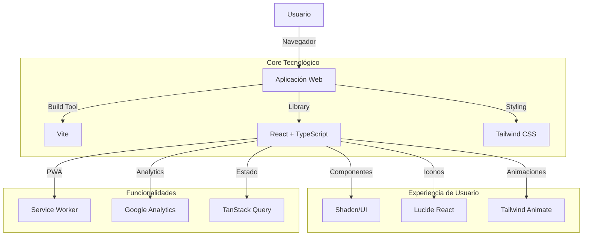
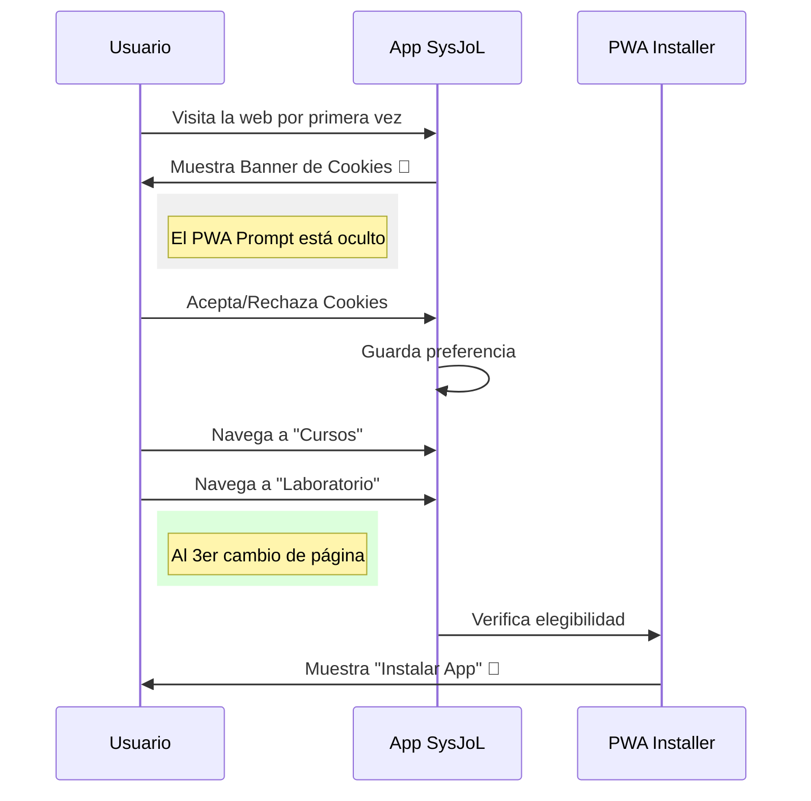

# SysJoL — Systems • Journey • Lab


**SysJoL** es un laboratorio de innovación tecnológica dedicado a la **automatización**, **transformación digital** y **educación**. Esta plataforma sirve como punto de encuentro para aprender, experimentar y descubrir soluciones de software escalables.

---

## 🛠️ Stack Tecnológico

El proyecto está construido sobre una arquitectura moderna, rápida y escalable.



### Tecnologías Clave

- **[Vite](https://vitejs.dev/):** Entorno de desarrollo de próxima generación.
- **[React](https://react.dev/):** Biblioteca para interfaces de usuario.
- **[TypeScript](https://www.typescriptlang.org/):** Tipado estático para código robusto.
- **[Tailwind CSS](https://tailwindcss.com/):** Framework de utilidades para diseño rápido.
- **[shadcn/ui](https://ui.shadcn.com/):** Componentes accesibles y personalizables.

---

## 🧠 Comportamiento y Experiencia de Usuario

La aplicación está diseñada para ofrecer una experiencia **progresiva y no intrusiva**.

### Flujo de Usuario Nuevo (UX Flow)



### Características Destacadas

1.  **Gestión Inteligente de Cookies**:
    - Cumplimiento con normativas de privacidad.
    - Google Analytics se activa _solo_ si el usuario da su consentimiento.
    - Persistencia de preferencias.

2.  **PWA (Progressive Web App)**:
    - Instalable en móviles y escritorio.
    - **Prompt Diferido**: No molestamos al usuario nada más entrar. Esperamos a que navegue y conozca la web antes de sugerir la instalación.

3.  **Diseño Responsivo**:
    - Interfaz adaptada a Móvil, Tablet y Desktop.
    - Tema oscuro/claro y paletas de colores modernas.

---

## 🚀 Instalación y Desarrollo

Para ejecutar este proyecto en tu máquina local:

### Prerrequisitos

- Node.js (v18 o superior)
- npm o bun

### Pasos

1.  **Clonar el repositorio**

    ```bash
    git clone https://github.com/Johlevic/sysjol-systems-journey-lab.git
    cd sysjol-systems-journey-lab
    ```

2.  **Instalar dependencias**

    ```bash
    npm install
    ```

3.  **Iniciar servidor de desarrollo**
    ```bash
    npm run dev
    ```
    La aplicación estará disponible en `http://localhost:8080`.

---

## 👥 Autor

**SysJoL Team**  
_Liderado por Johlevic_

> "Transformando sistemas, guiando el viaje hacia la innovación."

---

© 2026 SysJoL. Todos los derechos reservados.
